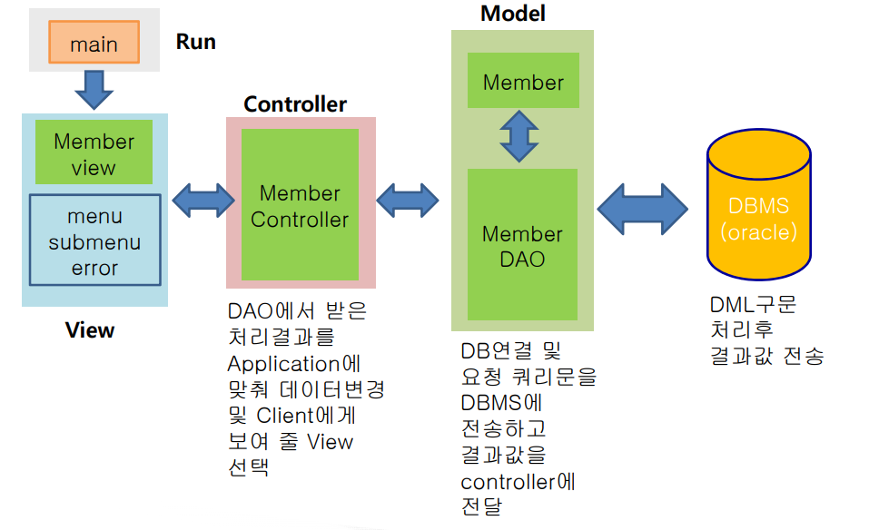

------

# Today I Learned (2019.07.12)


---
## ● JDBC(Java DataBase Connectivity)
---
>자바 언어에서 Database에 접근할 수 있게 해 주는 Programming API이다.
>
>>Java에서 DBMS연동에 필요한 메소드를 Connection인터페이스 제공
>>각 밴더(vendor)별 구현하여(jar파일 ) DBMS에 접속 가능하게 함.


---

#### 1. 설치 및 세팅

---

> 오라클을 사용했기 때문에 오라클의 OJDBC를 다운로드 한다.
>
> > - oracle 7 : classes111.zip 
> >
> > - oracle 8 : classes12.zip
> >
> > - oracle 9i : ojdbc14.jar 
> >
> > - oracle 10g : ojdbc14.jar
> >
> > - oracle 11g : ojdbc6.jar

   

---

##### 1-1. 다운로드 경로

---
> Link: [Oracle][https://www.oracle.com/technetwork/database/application-development/jdbc/downloads/index.html]
> **Oracle Database 11g Release 2 (11.2.0.4)  drivers ** 이동


---

##### 1-2. 설치하기

---
---

##### 1-2-1. [방법 1] jdk(또는 jre)에 JDBC설치하기

---


- [Window] - [Preferences] - [Java]  - [Installed JREs] 의 설치 경로가 jre 인 경우

    > 해당 JRE 위치에 다운로드 받은 ojdbc6.jar을 옮겨놓는다.
    > [C:] - [Program Files] - [Java] - [jre1.8.0_201] - [lib] - [ext]
  
- [Window] - [Preferences] - [Java]  - [Installed JREs] 의 설치 경로가 jdk 인 경우
  
    > 해당 JDE 위치에 다운로드 받은 ojdbc6.jar을 옮겨놓는다.
    > [C:] - [Program Files] - [Java] - [jdk1.8.0_201] - [lib] - [ext]

> 작업 완료 후 Eclipse를 재실행하여 Project를 생성한 후, 
> 해당 Project 하위 JRE System Library에 ojdbc6.jar이 포함되어 있는지를 확인.


---

##### 1-2-2. [방법 2] Eclipse Library 등록

---

> - 프로젝트에서 우클릭하여 properties클릭
>   (또는 [Build Path] - [Configure Build Path ...] 로 이동)
>
> - Libraries선택 후 Add External JARs.. 클릭 후 
>
> - ojdbc6파일이 있는 폴더로 가서 파일 선택 apply클릭

  

---

##### 1-2-3. [방법 3] 오라클에서 OJDBC파일 가져오기

---

> - C:\oraclexe\app\oracle\product\11.2.0\server\jdbc\lib
> 위의 위치에서 ojdbc6.jar을 옮겨오는 방법도 있다.


---

##### 1-3. 이클립스 Character Set설정

---
> 문자 인코딩 방식이 맞지 않으면 해당 문자가 제대로
> 출력되지 않아 이클립스 작업파일에 대한 문자 셋(set)을
> 일치시켜줘야 한다. (UTF-8)
>
>  - window – preferences 클릭
---

##### 1-3-1. 기본 문자 인코딩

---

> - **General - Workspace – Text file encoding – other에서 UTF-8 선택**
>
> - **General - Editors – Text Editors – Seplling UTF-8 변경**
---

##### 1-3-2. JSON 인코딩

---

> **JSON – JSON Files – Encoding – ISO 10646/Unicode(UTF-8) 선택**

---

##### 1-3-3. Web 인코딩

---

> **CSS Files, HTML Files, JSP Files도 수정**


---

#### 2. DataBase 생성

---
> 연결을 위한 Test DB를 생성한다.

```sql
-- 사용자 계정 생성 및 권한 설정
CREATE USER student IDENTIFIED BY student;
GRANT RESOURCE, CONNECT TO student;

-- DB생성(테이블명 : MEMBER)
CREATE TABLE MEMBER (
    MEMBER_ID VARCHAR2(15) PRIMARY KEY,
    MEMBER_PWD VARCHAR2(15) NOT NULL,
    MEMBER_NAME VARCHAR2(20) NOT NULL,
    GENDER CHAR(1) CHECK(GENDER IN ('M','F')),
    AGE NUMBER NOT NULL,
    EMAIL VARCHAR2(30),
    PHONE CHAR(11),
    ADDRESS VARCHAR2(500),
    HOBBY VARCHAR2(50),
    ENROLL_DATE DATE DEFAULT(SYSDATE)
);

-- COMMENT 달기
COMMENT ON COLUMN MEMBER.MEMEBER_ID IS '회원아이디';
COMMENT ON COLUMN MEMBER.MEMBER_PWD IS '회원비밀번호';
COMMENT ON COLUMN MEMBER.MEMBER_NAME IS '회원이름';
COMMENT ON COLUMN MEMBER.GENDER IS '성별';
COMMENT ON COLUMN MEMBER.AGE IS '나이';
COMMENT ON COLUMN MEMBER.EMAIL IS '이메일';
COMMENT ON COLUMN MEMBER.PHONE IS '전화번호';
COMMENT ON COLUMN MEMBER.ADDRESS IS '주소';
COMMENT ON COLUMN MEMBER.HOBBY IS '취미';
COMMENT ON COLUMN MEMBER.ENROLL_DATE IS '가입날짜';

-- 데이터 삽입
INSERT INTO MEMBER VALUES('admin','admin','관리자',
'M',30,'admin@iei.or.kr','0101234678',
'서울시 강남구 역삼동 테헤란로 7','기타,독서,운동','16/03/15');
INSERT INTO MEMBER VALUES('user11','pass11','홍길동',
'M',23,'hong@kh.org','01017778888',
'경기도 수원시 팔달구 팔달동 77','운동,등산,기타','17/09/21');
INSERT INTO MEMBER VALUES('user22','pass22','신사임당',
'F',48,'shin@50kh.org','01050005555',
'강원도 강릉시 오죽헌 5','독서,그림,요리','17/05/05');
INSERT INTO MEMBER VALUES('user77','user77','이순신',
'M',50,'dltnstls@naver.com','01021226374',
'경기도 시흥시','음악','17/12/08');
INSERT INTO MEMBER VALUES('lsj','lsj','이선주',
'F',24,'dltjswn@naver.com','01021226377',
'경기도 안산시','운동,음악,댄스','17/08/25');
INSERT INTO MEMBER VALUES('seonn','seonn','김공부',
'F',28,'study11@naver.com','01021226312',
'경기도 성남시','공부,책읽기','17/11/08');

-- 커밋!
COMMIT;
```


---

#### 3. JDBC class/interface

---

- DriverManager

> 데이터 원본에 JDBC 드라이버를 통하여 커넥션은 만드는 역할을 한다. 
> Class.forName()메소드를 통해 생성되며, 반드시 예외처리를 해야 한다. 
> 직접 객체 생성이 불가능하고, getConnection()메소드를 사용하여 객체를
> 생성할 수 있다. 

- Connection

> Connection객체는 특정 데이터 원본과 연결된 커넥션을 나타낸다.
> Statement객체를 생성할 때도 Connection객체를 사용하여
> createStatement()메소드를 호출하여 생성한다. 
> SQL문장을 실행시키기 전에 우선 Connection객체가 있어야 한다. 
>
> > DBMS에 대한 정보를 가지고 있다.

- Statement

> Connection객체에 의해 프로그램에 리턴되는 객체에 의해 구현되는
> 일종의 메소드 집합을 정의한다. Connection클래스의
> createStatement()메소드를 호출하여 얻어지며, 
> 생성된 Statement객체로 질의문장을 String객체에 담아
> 인자로 전달하여 excuteQuery()메소드를 호출하여 SQL 질의를 수행한다. 
>
> ```JAVA
> try{
> 	String query = “SELECT ID, LAST_NAME FROM EMP”
> 	stmt = conn.createStatement();
> 	rset = stmt.excuteQuery(query);
>     
> }catch(SQLException e){
> 	e.printStackTrace();
> }
> ```
>

- PreparedStatement

> Connection 객체의 preparedStatement()메소드를 사용하여 객체를
> 생성한다. SQL문장이 미리 컴파일되고, 실행시간동안 인수 값을 위한
> 공간을 확보할 수 있다는 점에서 Statement와 다르다. 각각의 인수에 
> 대해 위치홀더(?)를 사용하여 SQL문장을 정의할 수 있게 해준다.
>
> > ```JAVA
> > try{
> > 	String query = “insert into member value (?, ?);
> > 	pstmt = conn.preparedStatement(query);
> > 	pstmt.setString(1, id);
> > 	pstmt.setString(2, password);
> >     
> > }catch(SQLException e){
> > 	e.printStackTrace();
> > }
> > ```

- ResultSet

>SELECT문을 사용한 질의 성공시 ResultSet을 반환한다. ResultSet은
>SQL질의에 의해 생성된 테이블을 담고 있으며 ‘커서(cursor)라는 것을
>가지고 특정 행에 대한 참조를 조작한다.
>
>> ```java
>> String id = rset.getString(“ID”);
>> String lastName = rset.getString(2);
>> ```


---

#### 4. 작성 절차

---


---

##### 4-1. JDBC Coding 절차

---


---

##### 4-1-1. DriverManager에 해당 DBMS Driver 등록

---

> ```java
> Class.forName(“oracle.jdbc.driver.OracleDriver”);
> ```
>
> ```java
> cf) 다른 DB설정
> MSsql
> Class.forName(“com.Microsoft.jdbc.sqlserver.
> SQLServerDriver”);
> Mysql
> Class.forName(“org.gjt.mm.mysql.Driver”);
> ```
>
> > 반드시 **<span style="color:red">ClassNotFoundException 처리</span>** 해줘야한다.


---

##### 4-1-2. 해당 Driver로부터 Connection instance 획득

---

> ```java
> public static Connection getConnection(String url,
> 						 String user, String password)
> throws SQLException
> ```
>
> ```java
> Connection conn =
> 	DriverManager.getConnection(
> 		“jdbc:oracle:thin:@127.0.0.1:1521:XE”,
> 		“student”,
> 		“student”);
> ```
>
> > 반드시 **<span style="color:red">SQLException</span>** 처리 해줘야한다.
> >


---

##### 4-1-3. Connection instance로부터 Statement instance 획득

---

> ```java
> Statement stmt = conn.createStatememt();
> ```
>
> > 반드시 **<span style="color:red">SQLException</span>** 처리 해줘야한다.


---

##### 4-1-4. Statement method를 이용하여 SQL문 실행

##### 4-1-5. 실행 후 결과를 ResultSet(Selete)혹은 int형 변수(DML)로 받아서 처리

---

> ```java
> String query = “SELECT ID, LAST_NAME FROM EMP”;
> ResultSet rset = stmt.executeQuery(query);
> while(rset.next()){
> 	System.out.println(rset.getString(“ID”) + “\t”
> 						+ rset.getString(2));
> }
> ```
>
> ```java
> String query = “UPDATE EMP”
> 				+ “ SET LAST_NAME = ‘KIM’”
> 				+ “ WHERE ID = ‘10000’”;
> int result = stmt.executeUpdate(query);
> ```
>
> > 반드시 **<span style="color:red">SQLException</span>** 처리 해줘야한다.


---

##### 4-1-6. 사용한 자원 반납

---

> ```java
> rset.close(); //ResultSet 사용한 경우 반납처리
> stmt.close();
> conn.close();
> ```
>
> > 반드시 **<span style="color:red">SQLException</span>** 처리 해줘야한다.


------

#### 5. 직접 해보자!

------


------

##### 5-1. 드라이브 클래스를 등록

------

>  Class.forName() 메소드 이용
>
>  - 드라이버 객체 : oracle.jdbc.driver.OracleDriver

```java
Class.forName("oracle.jdbc.driver.OracleDriver");
```

> 위와 같이 작성할 경우 에러가 발생할 것이다. 예외 처리를 해주지 않았기 때문!

```java
try {
	Class.forName("oracle.jdbc.driver.OracleDriver");
    System.out.println("드라이버 등록 완료!");
} catch (ClassNotFoundException e) {
	e.printStackTrace();
}
```

> 정상적으로 완료 되었다면 다음과 같이 출력될 것이다.

```java
드라이버 등록 완료!
```


------

##### 5-2. 등록된 드라이버를 통해 DBMS의 접속 정보를 가져온다.
#####  ~
##### 5-6. 사용한 자원 반납

------

> 코드로 확인해 보자.

```java
try {
	Class.forName("oracle.jdbc.driver.OracleDriver");
	System.out.println("드라이버 등록 완료!");
	// 2. 등록된 드라이버를 통해 DBMS의 접속 정보를 가져옴
	// Connection 객체를 생성~!
	// DriverManager.getConnection(); 사용
	// getConnection() 메소드에 매개변수 대입
	// 1) DBMS 접속정보(url)
	// 2) 사용자 계정
	// 3) 사용자 계정 비밀번호
	// url은 정해진 패턴으로 작성을 해야함
	// jdbc:oracle:thin:@DB서버IP:포트번호:버전SID

	Connection conn = DriverManager.getConnection
			("jdbc:oracle:thin:@localhost:1521:xe", 
                   "student", "student");

	// Query문을 실행하고 결과값을 가져올 statement 객체 생성
	// Connection 객체의 createStatement()를 이용해서 생성
	Statement stmt = conn.createStatement();
	// Query문을 실행~!
	// Statement 객체의 executeQuery()/executeUpdate()
	// 매개변수로 sql구문을 문자열로 전달
	// excuteQuery() : select문을 실행할 때 사용 -> 반환값 ResultSet
	// executeUpdate() : DML 구문(insert,update,delete) 
						// 실행 시 사용 -> 반환값 : int
	String sql = "SELECT * FROM MEMBER";
	ResultSet rs = stmt.executeQuery(sql);
		
    // 데이터베이스 작업 종료!
	// 데이터베이스에서 가져온 데이터를 내 어플리케이션에
	// 맞게 데이터를 보관 -> vo 객체를 통해!
    //  vo : Value Object
    // 지금은 출력만! (다음 기회에.. )
	// ResultSet에 저장된 데이터를 가져오려면 
	// ResultSet에 get****()매소드를 이용
	//  ex) varchar2 -> String -> 
    // 					rs.getString("컬럼명칭" or index)
	// 		number -> int,double -> 
    //					rs.getInt/getDouble("컬럼명칭" or index)
	//	    date -> Date -> rs.getDate("컬럼명칭" or index)
    while(rs.next()) { // 몇 개가 있는지 모르기 때문에 반복문!
		System.out.println(rs.getString("member_id")
		// 컬럼 명칭이기 때문에 대소문자 구분을 하지 않는다.
					+ rs.getString("member_pwd")
					+ rs.getString("member_Name")
					+ rs.getString("gender")
					+ rs.getInt("age")
					+ rs.getString("email")
					+ rs.getString("address")
					+ rs.getString("hobby")
					+ rs.getDate("enroll_date")
		);
	}
          
} catch (ClassNotFoundException e) {
	e.printStackTrace();
} catch (SQLException e) {
	e.printStackTrace();
}
```

> 위 코드에서 포트번호 1521은 DataBase를 처음 설치할 때 설정했던 포트번호다.


> 여기서 해당 메소드들을 닫아 주어야하므로

```java
} catch (ClassNotFoundException e) {
			e.printStackTrace();
} catch (SQLException e) {
			e.printStackTrace();
} finally {
	// DB관련 객체 반환하기!
	// 반환할 때는 역순으로 반환을 해야함
	// RESULTSET있으면 ResultSet -> statment -> connection
	// 없으면 statemet -> connection
	// close() 메소드 이용
	rs.close();
	stmt.close();
	conn.close();
}
```

> 이렇게 처리할 경우 에러가 발생한다.  변수들 선언을 try 문 안에다 하였기 때문!

```java
Connection conn = null;
Statement stmt = null;
String sql;
ResultSet rs = null;
try {
	Class.forName("oracle.jdbc.driver.OracleDriver");
	System.out.println("드라이버 등록 완료!");

	conn = DriverManager.getConnection
			("jdbc:oracle:thin:@localhost:1521:xe", "student", 
	stmt = conn.createStatement();
	sql = "SELECT * FROM MEMBER";
	rs = stmt.executeQuery(sql);
	while(rs.next()) {
		System.out.println(rs.getString("member_id")
					+ rs.getString("member_pwd")
					+ rs.getString("member_Name")
					+ rs.getString("gender")
					+ rs.getInt("age")
					+ rs.getString("email")
					+ rs.getString("address")
					+ rs.getString("hobby")
					+ rs.getDate("enroll_date")
		);
	}
			
			
} catch (ClassNotFoundException e) {
	e.printStackTrace();
} catch (SQLException e) {
	e.printStackTrace();
} finally {
	try { // 마찬가지로 SQLException 처리를 해야한다.
		rs.close();
		stmt.close();
		conn.close();
	} catch (SQLException e) {
		e.printStackTrace();
	}
}			
```

> 출력화면을 보자

```java
드라이버 등록 완료!
adminadmin관리자M30admin@iei.or.kr서울시 강남구 역삼동 테헤란로 7기타,독서,운동2016-03-15
user11pass11홍길동M23hong@kh.org경기도 수원시 팔달구 팔달동 77운동,등산,기타2017-09-21
user22pass22신사임당F48shin@50kh.org강원도 강릉시 오죽헌 5독서,그림,요리2017-05-05
user77user77이순신M50dltnstls@naver.com경기도 시흥시음악2017-12-08
lsjlsj이선주F24dltjswn@naver.com경기도 안산시운동,음악,댄스2017-08-25
seonnseonn김공부F28study11@naver.com경기도 성남시공부,책읽기2017-11-08
```


> INSERT를 해보자!

```java
Connection conn = null;
Statement stmt = null;
String sql;
try {
	Class.forName("oracle.jdbc.driver.OracleDriver");

	conn = DriverManager.getConnection
       ("jdbc:oracle:thin:@localhost:1521:xe", "student", "student");
			
	stmt = conn.createStatement();
			
	sql = "INSERT INTO MEMBER VALUES('USER01'"
								 + ",'USER01'"
								 + ",'홍길동'"
								 + ",'M'"
								 + ",27"
								 + ",'ODO@LL'"
								 + ",'01012345678'"
								 + ",'성남시'"
								 + ",'독서,운동'"
								 + ",SYSDATE)";
	int result = stmt.executeUpdate(sql);
	
	if(result>0) System.out.println("회원가입완료");
	else System.out.println("가입실패");

} catch (ClassNotFoundException e) {
	e.printStackTrace();
} catch (SQLException e) {
	e.printStackTrace();
} finally {
	try {
		conn.close();
		stmt.close();
	} catch (SQLException e) {
		e.printStackTrace();
	}
			
}	
```

> 코드를 실행한 후, 위에 했던 코드를 다시 한 번 실행 해보면 ?

```java
드라이버 등록 완료!
adminadmin관리자M30admin@iei.or.kr서울시 강남구 역삼동 테헤란로 7기타,독서,운동2016-03-15
user11pass11홍길동M23hong@kh.org경기도 수원시 팔달구 팔달동 77운동,등산,기타2017-09-21
user22pass22신사임당F48shin@50kh.org강원도 강릉시 오죽헌 5독서,그림,요리2017-05-05
user77user77이순신M50dltnstls@naver.com경기도 시흥시음악2017-12-08
lsjlsj이선주F24dltjswn@naver.com경기도 안산시운동,음악,댄스2017-08-25
seonnseonn김공부F28study11@naver.com경기도 성남시공부,책읽기2017-11-08
USER01USER01홍길동M27ODO@LL성남시독서,운동2019-07-12
```

> '홍길동'이 INSERT된 것을 볼 수 있다!


> 그런데,  나는 COMMIT을 한 적 없지만 DB를 확인하면 자동으로 COMMIT이 되어있다.
> 이는 INSERT문을 사용할 때 자동으로 커밋을 하기 때문인데, 이를 개발자가 직접 
> 할 수 있도록 변경할 수 있다.

```java
conn = DriverManager.getConnection
     ("jdbc:oracle:thin:@localhost:1521:xe", "student", "student");
// 트랜잭션 관리를 개발자가 직접할 수 있도록 설정
conn.setAutoCommit(false); 
```

>그렇다면 커밋 위치는 어디에다?

```java
if(result>0) {
	System.out.println("회원가입완료");
	conn.commit(); // 이곳에다가 COMMIT !
}
else {
	System.out.println("가입실패");
	conn.rollback(); // 이곳에다가 ROLLBACK !
}
```


---
## ● DB 연동 구조1
---


---

#### 1.  package 구조(MVC)

---

> M(Model) , V(View), C(Controller)
>
> 소프트웨어 설계에서 세 가지 구성 요소인 모델(Model), 뷰(View), 컨트롤러(Controller)를 
> 이용한 설계 방식.


---

##### 1-1. Run

---

> 애플리케이션 실행을 위해 main메소드를 가지고 있는 패키지


------

##### 1-2. View

------

> Client에게 보여주는 화면을 담당


------

##### 1-3. Controller

------

> - View에서 전달받은 데이터를 가공처리(데이터변환, 디코딩) 후Service로 전달
> - Service로부터 전달 받은 결과에 따라 View(출력화면)를 결정하여 인코딩 후
> 데이터 전송


------

##### 1-4. Model 

------

> DBMS에서 전송된 데이터 또는 전송할 데이터를 보관할 수 있는 class가
> 있고, DBMS와 통신하면서 데이터를 주고 받는 class가 있는 패키지
>
> > - **VO (Value Object)**
> > 데이터베이스의 각 컬럼 개체(entity)저장용 클래스가 있는
> > 패키지
> > 동일용어 : DTO(Data Transfer Object), DO(Domain Object)
> > Entity, Bean(EJB용어)
> > 조건 : 모든 필드는 private, 기본생성자와 매개변수가 있는
> > 생성자가 반드시 필요, 모든 필드에 대한 생성자가
> > 필요, <u>직렬화(Serializable)</u>가 필요
> > - **DAO(Database Access Object)**
> > DBMS에 접속하여 실제 데이터를 전송하거나 결과값을
> > 전달받는 역할을 수행하는 class가 있는 패키지


------

#### 2.  Class 구조

------




> **상세구조**


------

#### 3.  만들어 봅시다.

------

> MVC 패턴을 이용한 패키지 구조 설계(Basic)


> 다음 시간에 이어서 ... 